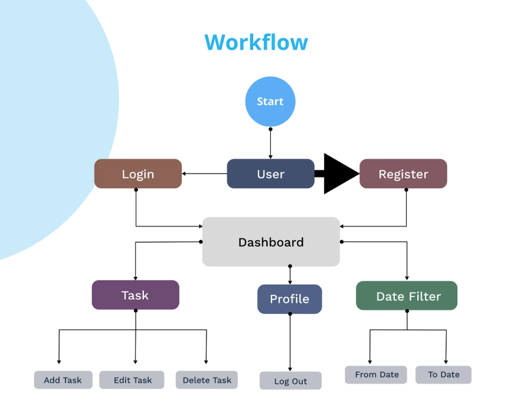

# Todo Task Management Application

This is a full-stack [Todo Task](https://github.com/KishoreKumar0603)
  Management Web Application that allows users to:

- Sign in via social logins (**Google**)
- Manage **personal and shared tasks**
- Perform full **CRUD operations**
- **Filter** and **sort** tasks
- **Collaborate** by sharing tasks with others

---

## ✨ Features

✅ User authentication via **OAuth 2.0 (Google, GitHub, Facebook)**  
✅ JWT-based session management  
✅ Tasks scoped per user and shared users  
✅ **Real-time updates**  
✅ Pagination & sorting  
✅ Rate limiting and input validation  
✅ Modular backend with **Express.js controllers**  
✅ Clean, animated frontend with **React.js + Tailwind CSS / Bootstrap**

---

### 🔧 Tech Stack

- **Frontend:** React.js, Axios, React Router Dom, Bootstrap  
- **Backend:** Node.js, Express.js, JWT, OAuth2, Passport.js  
- **Database:** MongoDB with Mongoose   
- **Deployment:** Render / Vercel / MongoDB Atlas

---

## ⚙️ Local Setup Instructions

1. **Clone the repository**

```bash
git clone https://github.com/KishoreKumar0603/Todo.git
```

after cloning, run the following commands
```bash
cd todo-app
cd backend
npm install
npm start //nodemon
```

2.Environmental Variables for backend

`API_KEY`

`ANOTHER_API_KEY`

`PORT`

`MONGO_URI= your-mongodb-url`

`JWT_SECRET= secret`

`CLIENT_URL= frontend`

`GOOGLE_CLIENT_ID=your-google-client-id`

`GOOGLE_CLIENT_SECRET=your-google-client-secret`


3.Frontend

run the command in root todo-app folder

```bash
cd ../frontend
npm install
```
4.create .env in frontend folder

`VITE_API_URL = your-backend-api`


5.Start frontend
```bash
npm run dev
```

## 🏗️ Project Architecture



## Project Demo
[ Project Demo Video](https://drive.google.com/file/d/1B8qMZongt9nqlJf1IoTtb9O0enkKOuJf/view?usp=drive_link)


<p align="center"><strong>******** Thank you for Reading ********</strong></p>

